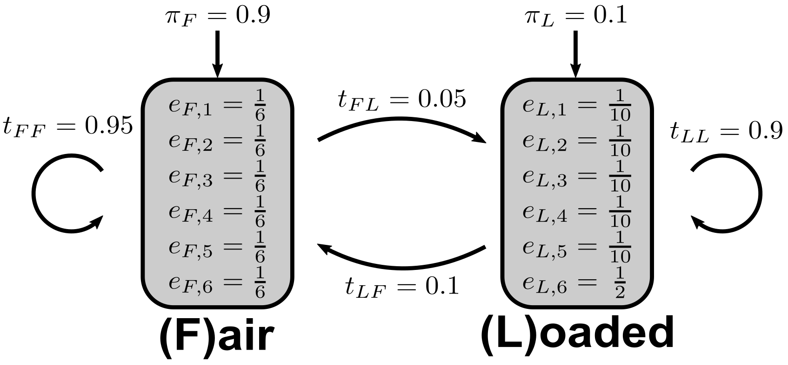

---------------------------------

# Exercise 1 - Two kinds of dice

```{r, echo=FALSE, out.width="100%", fig.align='center'}
knitr::include_graphics("figures/exercise-1/Dice-E1.png")
```


A casino uses two kinds of dice: $98\%$ of dice are fair and $2\%$ are loaded. The loaded die has a probability of $0.5$ to show number six and $0.1$ for the numbers one to five.


#### {.tabset}

##### Question 1A

::: {.question data-latex=""}

When we pick up a die from a table at random, what is the probability of rolling a six?

::: 

##### Hint 1 : Formulae

::: {.answer data-latex=""}

$$
L= \text{Loaded} \quad F= \text{Fair}\quad \mathcal{O}= \text{Observation}\\
P(\mathcal{O}) = P(F) \times P(\mathcal{O}|F) + P(L) \times P(\mathcal{O}|L)
$$
::: 

##### Hint 2 : Calculation Method

::: {.answer data-latex=""}

$$
P(6) = 0.98 \times \frac{1}{6} + 0.02 \times \frac{1}{2}
$$
::: 

##### Solution

::: {.answer data-latex=""}

$$
P(6) = 0.173\bar{3}
$$
::: 

#### {-}


#### {.tabset}

##### Question 1B

::: {.question data-latex=""}

We pick up a die from a table at random and roll [`r knitr::asis_output("\U2685 \U2685 \U2685")`]. What is the probability, that the die is loaded.
::: 

##### Hint 1 : Formulae

::: {.answer data-latex=""}

$$
P(L|\mathcal{O}) = \frac{P(L,\mathcal{O})}{P(\mathcal{O})}\\
P(L,\mathcal{O}) = P(\mathcal{O}|L) \times P(L)
$$
::: 

##### Hint 2 : Calculation Method

::: {.answer data-latex=""}

\begin{align*}
P(L|\mathcal{O}) &= \frac{P(\mathcal{O}|L)\times P(L)}{P(\mathcal{O}|L)\times P(L) + P(\mathcal{O}|F)\times P(F)}\\
       &= \frac{(\frac{1}{2})^3 \times 0.02}{(\frac{1}{2})^3 \times 0.02 + (\frac{1}{6})^3 \times 0.98}
\end{align*}
::: 

##### Solution

::: {.answer data-latex=""}
$$
P(L|\mathcal{O}) = 35.53\%
$$
::: 

#### {-}


#### {.tabset}

##### Question 1C

::: {.question data-latex=""}

How many sixes in a row would we need to roll to be at least 90\% sure that the die is loaded?
::: 

##### Hint 1 : Formulae

::: {.answer data-latex=""}

$$
P(L|\mathcal{O}) = \frac{P(\mathcal{O}|L)\times P(L)}{P(\mathcal{O}|L)\times P(L) + P(\mathcal{O}|F)\times P(F)}\\
$$
::: 

##### Hint 2 : Calculation Method

::: {.answer data-latex=""}

\begin{alignat}{3}
&P(L|\mathcal{O}) = \frac{\frac{2}{100}\times(\frac{1}{2})^n}{\frac{2}{100}\times(\frac{1}{2})^n + \frac{98}{100}\times(\frac{1}{6})^n} &&\geq 0.9 &&\quad| \text{ split } (\frac{1}{6})^n\\
&\iff \frac{\frac{2}{100}\times(\frac{1}{2})^n}{\frac{2}{100}\times(\frac{1}{2})^n + \frac{98}{100}\times(\frac{1}{2})^n \times (\frac{1}{3})^n} &&\geq \frac{9}{10}  &&\quad| \text{ factorize}\\
&\iff \frac{\frac{2}{100}\times(\frac{1}{2})^n}{\frac{2}{100}\times(\frac{1}{2})^n \times (1 + 49 \times (\frac{1}{3})^n)} &&\geq \frac{9}{10} &&\quad| \text{ simplify, given } n > 0\\
&\iff \frac{1}{1 + 49 \times (\frac{1}{3})^n} &&\geq \frac{9}{10} &&\quad| \text{ cross-multiply, given } n > 0\\
&\iff \frac{9}{10} (1 + 49 \times (\frac{1}{3})^n) &&\leq 1  &&\quad| \text{ rewrite }\\
&\iff (\frac{1}{3})^n &&\leq \frac{1}{441}  &&\quad| \text{ ln() }\\
&\iff n \times ln(\frac{1}{3}) &&\leq ln(\frac{1}{441}) &&\quad| \times\frac{1}{ln(\frac{1}{3})} \\
&\iff n &&\geq \frac{ln(\frac{1}{441})}{ln(\frac{1}{3})}\\
&\iff n &&\geq 5.542487...
\end{alignat}
::: 

##### Solution

::: {.answer data-latex=""}
$$
n = 6 \text{, as only Integers make sense here (just trying would also work)}
$$
::: 

#### {-}


-------------------------------------------


# Exercise 2 - The occasionally cheating casino

```{r, echo=FALSE, out.width="25%", fig.align='center'}
knitr::include_graphics("figures/exercise-1/Dice-E2.png")
```

In a casino they use a fair die most of the time, but occasionally they switch to a loaded die. The loaded die has a probability $0.5$ to show number six and probability $0.1$ for the numbers one to five. Assume that the casino switches from a fair to a loaded die with probability $0.05$ before each roll, and that the probability of switching back is $0.1$. The probability to start a game with the fair die is $0.9$.

#### {.tabset}

##### Question 2A

::: {.question data-latex=""}
Draw a graphical representation of the described Hidden Markov model.
::: 


##### Solution

::: {.answer data-latex=""}

```{r, echo=FALSE, out.width="100%", fig.align='center'}

```
::: 

#### {-}


#### {.tabset}

##### Question 2B

::: {.question data-latex=""}
Given an observed sequence of outcomes $\mathcal{O} = 3661634$ and two possible state sequences $s_1 = LLLFFFF$ and $s_2 = FFFFFFF$ (where $F$ = Fair and $L$ = Loaded), what are the joint probabilities $P(\mathcal{O}, p_1)$ and $P(\mathcal{O}, p_2)$ in the HMM described above?
::: 


##### Hint 1 : Formulae

::: {.answer data-latex=""}
$$
P(\mathcal{O}, p_x) = P(\mathcal{O}|p_x) \times P(p_x)
$$
::: 

##### Hint 2 : Calculation Method

::: {.answer data-latex=""}
\begin{align*}
P(s_1)   =& \pi_L \times t_{LL}^2 \times t_{LF} \times t_{FF}^3 = 0.1 \times 0.9^2 \times 0.1 \times (0.95)^3 = 0.0069 \\
P(s_2)   =& \pi_F \times t_{FF}^6  = 0.9 \times 0.95^6 = 0.6616 \\
P(\mathcal{O}|s_1) =& t_{L,3} \times t_{L,6}^2 \times t_{F,1} \times t_{F,6} \times t_{F,3} \times t_{F,4} = 0.1 \times 0.5^2 \times (\frac{1}{6})^4 = 1.9 \times 10^{-5} \\
P(\mathcal{O}|s_2) =& t_{F,3} \times t_{F,6}^2 \times t_{F,1} \times t_{F,6} \times t_{F,3} \times t_{F,4} = (\frac{1}{6})^7 = 3.57 \times 10^{-6} \\
P(\mathcal{O},s_1) =& P(\mathcal{O}|s_1) \times P(s_1)= 1.9 \times 10^{-5} \times 0.0069 \\
P(\mathcal{O},s_2) =& P(\mathcal{O}|s_2) \times P(s_2)= 3.57 \times 10^{-6} \times 0.6616
\end{align*}
::: 

##### Solution

::: {.answer data-latex=""}
\begin{align*}
P(\mathcal{O},s_1) &= 1.34 \times 10^{-7}\\
P(\mathcal{O},s_2) &= 2.36 \times 10^{-6}
\end{align*}
::: 

#### {-}


#### {.tabset}

##### Question 2C

::: {.question data-latex=""}
Give an observation $\mathcal{O} = 1662$, how many possible state sequences exist in the described HMM?
::: 


##### Hint 1

::: {.answer data-latex=""}
The actual observation does not matter in this case because all emission probabilities are $>0$. This there are $2^4$ possible state sequences.
::: 

##### Solution

::: {.answer data-latex=""}
There are $16$ possible state sequences.
::: 

#### {-}

-------------------------------------------

# Exercise 3 - Programming assignment

Programming assignments are available via Github Classroom and contain automatic tests.

We recommend doing these assignments as they will help you further your understanding of this topic.

Access the Github Classroom link: [Programming Assignment: Sheet 01]().

-------------------------------------------

```{r, include=knitr::is_html_output(), echo=F}
knitr::asis_output('Download: <a href="exercise-sheet-1.pdf" title="Download PDF Version">PDF Version</a> of this page.')
```
