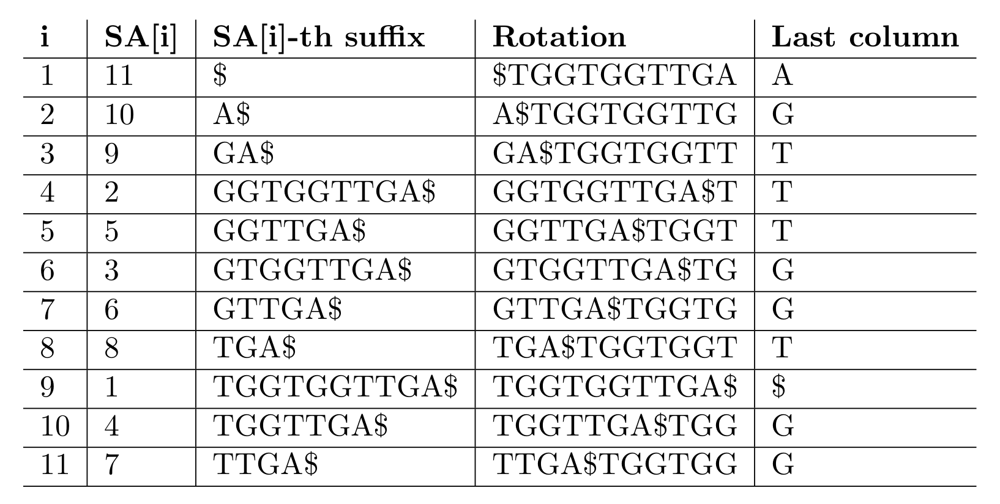
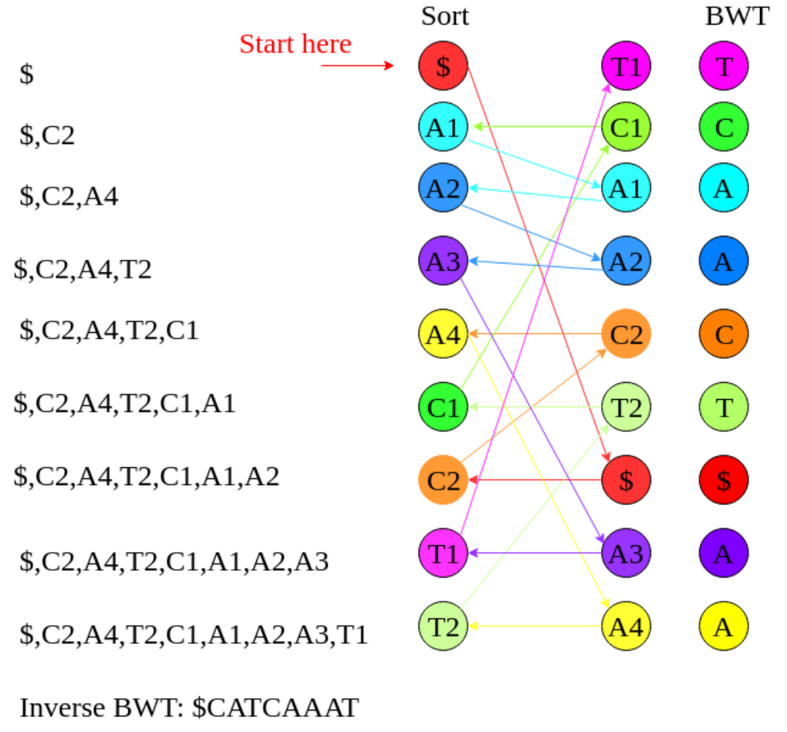
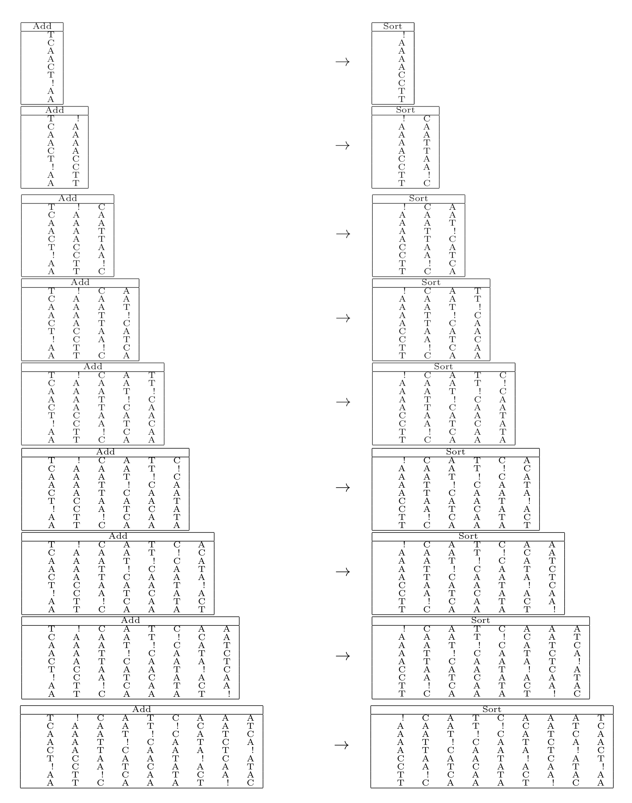
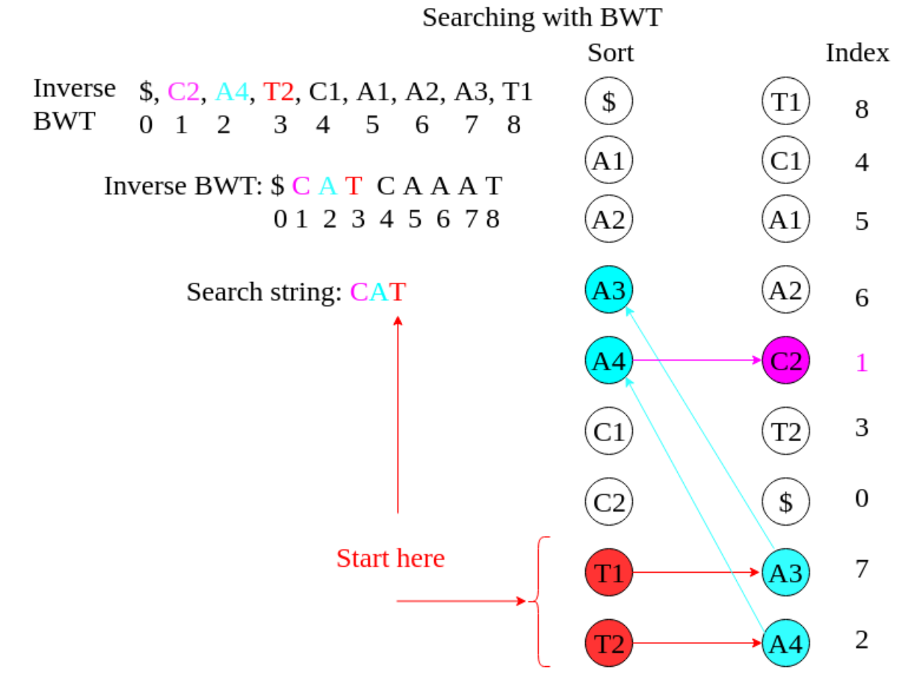

```{r, include=FALSE}
source("custom_functions.R")
library(flextable)
library(officer)

```

---
title: "Exercise sheet 10: Introduction to Mapping"
---

---------------------------------

# Exercise 1

#### {.tabset}

##### Question 1A
::: {.question data-latex=""}
Extract the Burrows-Wheeler Transform B(S) of $S = TGGTGGTTGA\$$.
::: 

##### Solution
::: {.answer data-latex=""}

$B(S) = AGTTTGGT\$GG$

```{r, echo=FALSE, out.width="100%", fig.align='center'}

```

::: 
#### {-}

#### {.tabset}

##### Question 1B
::: {.question data-latex=""}
Invert the Burrows-Wheeler-Transform $B(S) = TCAACT\$AA$ to obtain S.
::: 


##### Hint 1
::: {.answer data-latex=""}

You can get the first column $F(S)$ of the Burrows Wheeler Matrix via 
counting and sorting the letters since it has a very predictably structure.

$F(S) = \$AAAACCTT$ 


::: 


##### Hint 2
::: {.answer data-latex=""}

Use the last-first mapping to assign indices to the corresponging letters 
in the first $F(S)$ and the last column $B(S)$

$F(S) = \$_1A_1A_2A_3A_4C_1C_2T_3T_4$

$B(S) = T_1C_1A_1A_2C_2T_2\$_1A_3A_4$

::: 

##### Solution 1
::: {.answer data-latex=""}
```{r, echo=FALSE, out.width="80%", fig.align='center'}

```
::: 

##### Solution 2
::: {.answer data-latex=""}

Step-by-step method:

```{r, echo=FALSE, out.width="100%", fig.align='center'}

```
::: 

#### {-}

#### {.tabset}

##### Question 1C
::: {.question data-latex=""}
Search for $CAT$ in $B(S) = TCAACT\$AA$.
::: 

##### Solution
::: {.answer data-latex=""}
```{r, echo=FALSE, out.width="80%", fig.align='center'}

```
::: 
#### {-}

# Exercise 2

#### {.tabset}
::: {.question data-latex=""}
Read the publication on the bwa-mem aligner at https://arxiv.org/abs/1303.3997 and pay
particular attention to the re-seeding and chaining features of the algorithm. Now consider a read
$R = CCCCGTTTT$ and a reference genome $T = ...CCCCATTTT...CCCCGA...AGTTTT...$ and
explain step-by-step how re-seeding and chaining let bwa-mem let recover the correct best alignment
of $R$ to $T$.
::: 

##### Question 2A
::: {.question data-latex=""}
What are the original SMEMs that get generated?
::: 
##### Solution
::: {.question data-latex=""}
The original MEMs are CCCCG and GTTTT.
::: 
#### {-}

#### {.tabset}

##### Question 2B
::: {.question data-latex=""}
Would these SMEMs lead to discovery of the best possible alignment?
::: 

##### Solution
::: {.answer data-latex=""}
No, because it would not lead to a best possible match in the reference genome. The current
seeds are too specific and we may miss the seeds that lead to the best mapping (CCC-
CATTTT), therefore we need to reseed.
::: 
#### {-}

#### {.tabset}

##### Question 2C
::: {.question data-latex=""}
Which shortened new SMEMs are discovered with re-seeding (assume re-seeding gets perfor-
med despite the below-threshold length of the SMEMs)?
::: 

##### Solution
::: {.answer data-latex=""}
Re-seeding around the central base of each MEM leads to discovery of CCCC and TTTT
(both occur once more often than the originals).
::: 
#### {-}

#### {.tabset}

##### Question 2D
::: {.question data-latex=""}
What is the effect of chaining of colinear seeds?
::: 

##### Solution
::: {.answer data-latex=""}
The two new seeds are colinear on R and T , and can be merged into a chain, so only one
local alignment has to be performed.
::: 
#### {-}


