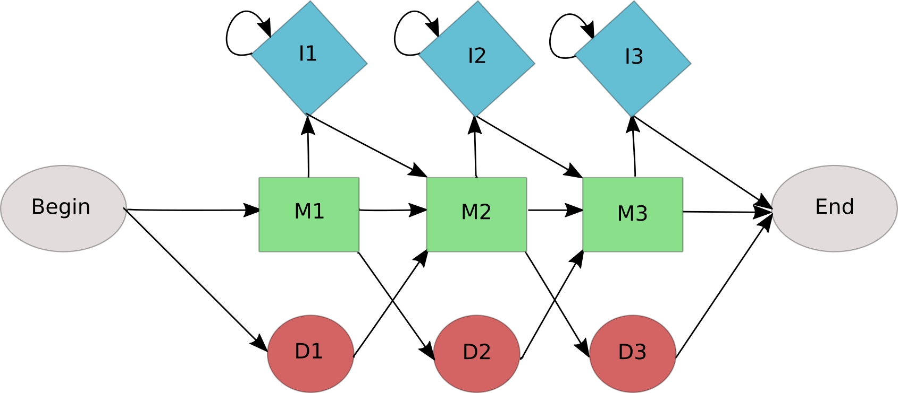

---------------------------------

# Exercise 1 - The occasionally cheating casino

In a casino they use a fair die most of the time, but occasionally they switch to a loaded die. The loaded die has a probability $0.5$ to show number six and probability $0.1$ for the numbers one to five. Assume that the casino switches from a fair to a loaded die with probability $0.05$ before each roll, and that the probability of switching back is $0.1$. The probability to start a game with the fair die is $0.9$.


#### {.tabset}

##### Question 1A

::: {.question data-latex=""}
Find the probability $P(\mathcal{O}|M)$ for $\mathcal{O}=1662$ and the given HMM using the forward algorithm. 
::: 


##### Hint 1 : Formulae

::: {.answer data-latex=""}
\begin{align*}
\alpha_{1}(i)   =& \pi_{i} \times b_{i,o_1}\\
\alpha_{t+1}(j) =& \sum_{i\in\{F,L\}}\alpha_{t}(i)\times a_{i,j}\times b_{j,o_{t+1}}
\end{align*}
::: 

##### Hint 2 : Calculation Method

::: {.answer data-latex=""}
\begin{align*}
\alpha_1(F) =& \pi_F \times b_{F,1} = 0.9 \times \frac{1}{6} = 0.15\\
\alpha_1(L) =& \pi_F \times b_{L,1} = 0.1 \times 0.1 = 0.01\\\\
\alpha_2(F) =& \alpha_{1}(F)\times a_{F,F}\times b_{F,6} + \alpha_{1}(L)\times a_{L,F}\times b_{F,6} =  0.15 \times 0.95 \times \frac{1}{6} + 0.01 \times 0.1 \times \frac{1}{6} = 0.0239167\\
\alpha_2(L) =& \alpha_{1}(F)\times a_{F,L}\times b_{L,6} + \alpha_{1}(L)\times a_{L,L}\times b_{L,6} =  0.15 \times 0.05 \times 0.5 + 0.01 \times 0.9 \times 0.5 = 0.00825\\
\alpha_3(F) =& 0.023917 \times 0.95 \times \frac{1}{6} + 0.00825 \times 0.1 \times \frac{1}{6} = 0.00392\\
\alpha_3(L) =& 0.023917 \times 0.05 \times 0.5 + 0.00825 \times 0.9 \times 0.5 = 0.00431\\
\alpha_4(F) =& 0.00392 \times 0.95 \times \frac{1}{6} + 0.00431 \times 0.1 \times \frac{1}{6} = 0.000693\\
\alpha_4(L) =& 0.00392 \times 0.05 \times 0.1 + 0.00431 \times 0.9 \times 0.1 = 0.000407\\
\end{align*}
::: 

##### Solution

::: {.answer data-latex=""}
$$
P( \mathcal{O}=1662)= \alpha_4(F)+\alpha_4(L) = 0.000693 + 0.000407 = 0.0011
$$
::: 

#### {-}


#### {.tabset}

##### Question 1B

::: {.question data-latex=""}
Given the result of Question 1A, do you expect a higher probability for the observations $\mathcal{O} = 1666$ and $\mathcal{O} = 1262$?
::: 

##### Hint 1

::: {.answer data-latex=""}
It has something to do with the emission probabilities of the different states.
::: 

##### Solution

::: {.answer data-latex=""}
As state L has a high probability to emit a six, observations with more sixes are more likely.

$$
P(\mathcal{O} = 1666) > P(\mathcal{O} = 1662) > P(\mathcal{O} = 1262)
$$
::: 

#### {-}


#### {.tabset}

##### Question 1C

::: {.question data-latex=""}
Find the most probable path through the HMM that produces the sequence $\mathcal{O} = 1662$.
::: 

##### Hint 1 : Formulae

::: {.answer data-latex=""}
\begin{align*}
\delta_{1}(i)   =& \pi_{i} \times b_{i,o_1}\\
\delta_{t+1}(j) =& max_{i\in\{F,L\}}\delta_{t}(i)\times a_{i,j} \times b_{j,o_{t+1}}\\
q_{t}^{ * }     =& argmax_{1 \leq i \leq n}  \{ \delta_t(i) a_{i,q_{t+1}^{ * } } \}
\end{align*}
::: 

##### Hint 2 : Intermediate calculations

::: {.answer data-latex=""}
\begin{align*}
\delta_1(F) =& \pi_F \times b_{F,1} = 0.9 \times \frac{1}{6} = 0.15\\
\delta_1(L) =& \pi_F \times b_{L,1} = 0.1 \times 0.1 = 0.01\\\\
\delta_2(F) =& max(\delta_{1}(F) \times a_{F,F} \times b_{F,6}, \delta_{1}(L) \times a_{L,F} \times b_{F,6}) = max(0.02375 , 0.00016) = 0.02375 \\
\delta_2(L) =& max(\delta_{1}(F) \times a_{F,L} \times b_{L,6}, \delta_{1}(L) \times a_{L,L} \times b_{L,6}) = max(0.00375, 0.0045) = 0.0045\\
\delta_3(F) =& max(0.00376, 0.000075) = 0.00376\\
\delta_3(L) =& max(0.00059375, 0.002025) = 0.002025\\
\delta_4(F) =& max(0.0005953, 0.00003375) = 0.0005953\\
\delta_4(L) =& max(0.0000188, 0.00018225) = 0.00018225\\\\
P( \mathcal{P}^{*}, \mathcal{O}) =& max(\delta_4(F), \delta_4(L)) = 5.95 \times 10^{-4}
\end{align*}
::: 

##### Solution

::: {.answer data-latex=""}

\begin{align*}
q_4^* =& argmax_{i\in\{F,L\}}(\delta_4(i)) = F\\
q_3^* =& argmax_{i\in\{F,L\}}(\delta_3(i) \times a_{i,q_4^*}) = argmax(F:0.00376 \times 0.95, L:0.002025 \times 0.1) = F\\
q_2^* =& argmax_{i\in\{F,L\}}(\delta_2(i) \times a_{i,q_3^*}) = argmax(F:0.02375 \times 0.95, L:0.0045 \times 0.1) = F\\
q_1^* =& argmax_{i\in\{F,L\}}(\delta_1(i) \times a_{i,q_2^*}) = argmax(F:0.15 \times 0.95, L:0.01 \times 0.1) = F\\
\Rightarrow& Q^*=FFFF
\end{align*}

The best path is therefore to stay in state F.
::: 

#### {-}

-------------------------------------------


# Exercise 2 - Profile HMMs

Profile HMMs define a position specific scoring scheme which can be used to search databases for homologous sequences. 

The following multiple alignment of DNA sequences is given:

```
                                        AC---A
                                        A----A
                                        AG---T
                                        TTGGGT
                                        **   *
```

#### {.tabset}

##### Question 2A

::: {.question data-latex=""}

Draw the graphical representation of the profile HMM for the given multiple alignment.
 
:::


##### Solution

::: {.answer data-latex=""}

```{r, echo=FALSE, out.width="100%", fig.align='center'}

```
:::
#### {-}

#### {.tabset}

##### Question 2B

::: {.question data-latex=""}

Find the state sequences that correspond to each row in the alignment. 
:::

##### Solution

::: {.answer data-latex=""}

```
                                  AC---A M1 M2 M3
                                  A----A M1 D2 M3
                                  AG---T M1 M2 M3
                                  TTGGGT M1 M2 I2 I2 I2 M3
```
:::
#### {-}

#### {.tabset}

##### Question 2C

::: {.question data-latex=""}
Compute the following emission probabilities with maximum likelihood estimation: $b_{M_1,A}$, $b_{M_1,G}$, $b_{M_1,C}$, $b_{M_1,T}$.

:::

##### Formulae

::: {.answer data-latex=""}
<!-- $$ b_{i,k} = Pr[r_t=k | q_t = i], \\ \text{with } t \text{ a point in time } (t -->
<!-- \in T)\\ q_1 ... q_t ... q_T \text{ random variables for the states}\\ r_1 ... -->
<!-- r_t ... r_T \text{ random variables for the outputs}\\ k \in \Sigma \text{ a -->
<!-- finit output alphabet} $$ -->
$$
b_{i,k} = \frac{E[\text{number of emissions of } \sigma_k \text{, while in state } i | \mathcal{O}, M]}{E[\text{number of times in state } i | \mathcal{O}, M]}
$$
:::

##### Solution

::: {.answer data-latex=""}

$b_{M_1,A}=\frac{3}{4}$

$b_{M_1,G}=0$

$b_{M_1,C}=0$

$b_{M_1,T}=\frac{1}{4}$

:::
#### {-}

#### {.tabset}

##### Question 2D

::: {.question data-latex=""}
Compute the following transition probabilities with maximum likelihood estimation: $a_{M_2,M_3}$, $a_{M_2,I_2}$, $a_{M_2,D_3}$
:::

##### Formulae

::: {.answer data-latex=""}
$$
a_{i,j} = \frac{E[\text{number of transitions from }  i \text{ to } j | \mathcal{O}, M]}{E[\text{number of transitions from } i | \mathcal{O}, M]}
$$
:::

##### Solution

::: {.answer data-latex=""}

$a_{M_2,M_3} = \frac{2}{2+1+0} = \frac{2}{3}$

$a_{M_2,I_2} = \frac{1}{2+1+0} = \frac{1}{3}$

$a_{M_2,D_3} = \frac{0}{2+1+0} = 0$

:::
#### {-}

#### {.tabset}

##### Question 2E

::: {.question data-latex=""}
Repeat the calculations from c) and d) using a pseudo-count of $1$. 
:::

##### Solution

::: {.answer data-latex=""}

$b_{M_1,A}=\frac{3+1}{4+4}=\frac{1}{2}$

$b_{M_1,G}=\frac{0+1}{4+4}=\frac{1}{8}$

$b_{M_1,C}=\frac{0+1}{4+4}=\frac{1}{8}$

$b_{M_1,T}=\frac{1+1}{4+4}=\frac{1}{4}$

$a_{M_2,M_3} = \frac{2+1}{2+1+0+3} = \frac{1}{2}$

$a_{M_2,I_2} = \frac{1+1}{2+1+0+3} = \frac{1}{3}$

$a_{M_2,D_3} = \frac{0+1}{2+1+0+3} = \frac{1}{6}$

:::
#### {-}


