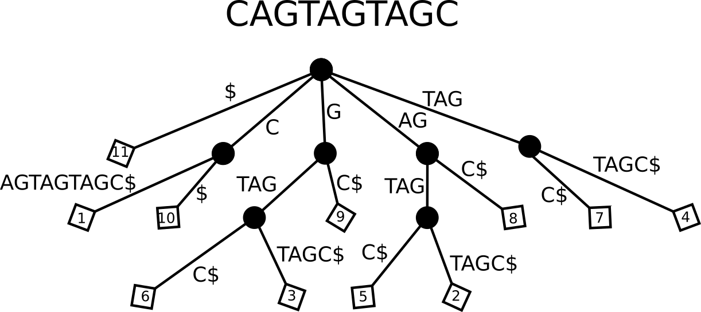
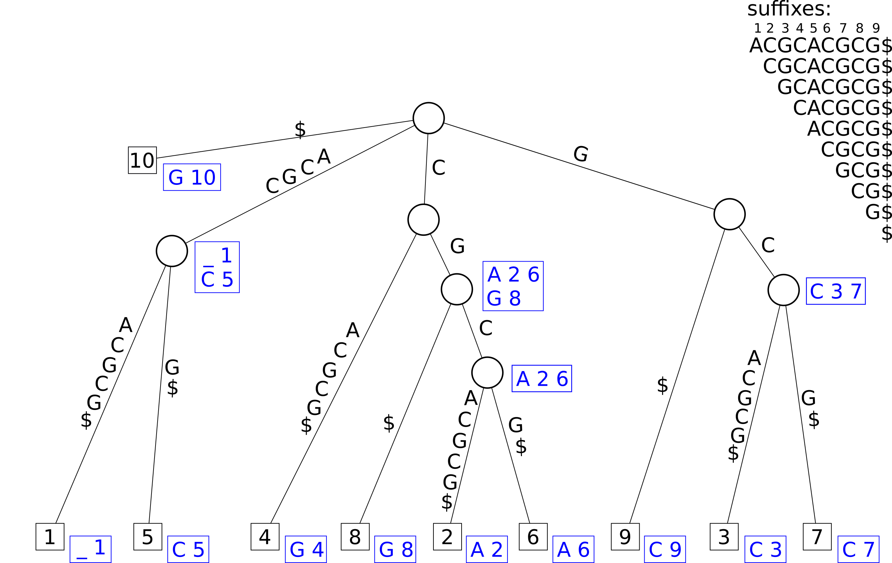

```{r, include=FALSE}
source("custom_functions.R")
library(flextable)
library(officer)

```

---
title: "Exercise sheet 7: Suffix-Trees"
---

---------------------------------

# Exercise 1

You are given the text $T=CAGTAGTAGC$


#### {.tabset}

##### Question 1A

Draw the corresponding suffix tree

##### Solution

```{r, echo=FALSE, out.width="100%", fig.align='center'}

```


#### {-}

#### {.tabset}

##### Question 1B

Describe the steps of a counting query for $P = TAG$

##### Solution

* start at root node
* locate outgoing edge that starts with $T$
* match subsequent characters of the pattern
* in the subtree rooted at $\overline{TAG}$ count the number of leaves $\Rightarrow 2$

#### {-}


#### {.tabset}

##### Question 1C

Describe the steps of a reporting query for $P = AG$

##### Solution

* start at root node
* locate outgoing edge that start with $A$
* match subsequent characters of the pattern
* in the subtree rooted at $\overline{AG}$ report the labels of all leaves $\Rightarrow \{2, 5, 8\}$

#### {-}

# Exercise 2

#### {.tabset}

##### Question 2A

Draw a generalized suffix tree for the sequences $A=CCATG$ and $B=CATG$.

##### Hint 1 

Concatenate the two sequences using a unique character for splitting. e.g.
$CCATG\#CATG\$$.

Dont forget to include suffix links 

##### Formulae

$sl(v) = w$

$v = \overline{cb}$

$w = \overline{b}$

$c: character, b: string$


remember: over lined strings are a representation for the node at that string

##### Solution


```{r, echo=FALSE, out.width="100%", fig.align='center'}
knitr::include_graphics("figures/sheet-7/suffix_tree_2.png")
```

#### {-}

#### {.tabset}

##### Question 2B

Find the Maximal Unique Matches of the sequences $A=CCATG$ and $B=CATG$ using 
the tree from A)

##### Solution

$CATG$ is the only MUM as $v = \overline{CATG}$ has no suffix links pointing to
it

#### {-}


# Exercise 3

#### {.tabset}

##### Question 3A

Draw a generalized suffix tree for the sequence $A=ACGCACGCG$.

##### Solution


```{r, echo=FALSE, out.width="100%", fig.align='center'}

```

#### {.tabset}

##### Question 3B

Find all maximal pairs of length at least 2

##### Solution

$ACGC: (1,5,4)$

$CG: (2,8,2), (6,8,2)$

#### {-}


