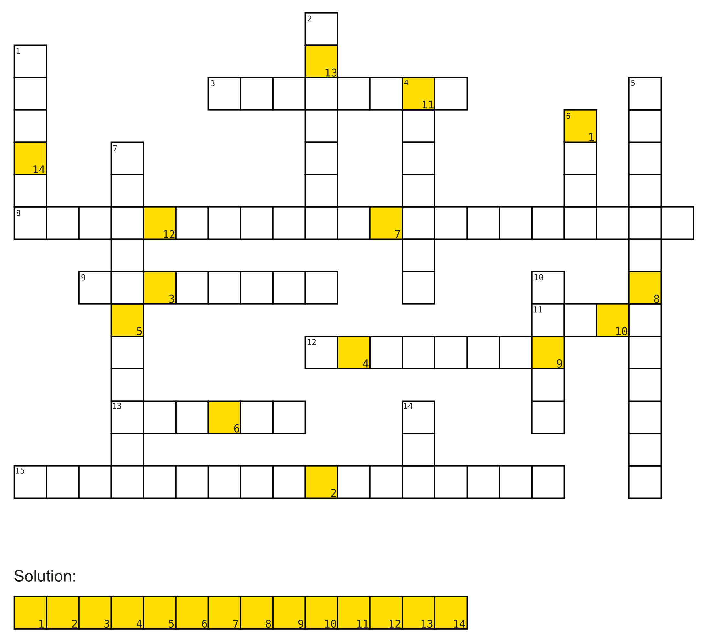
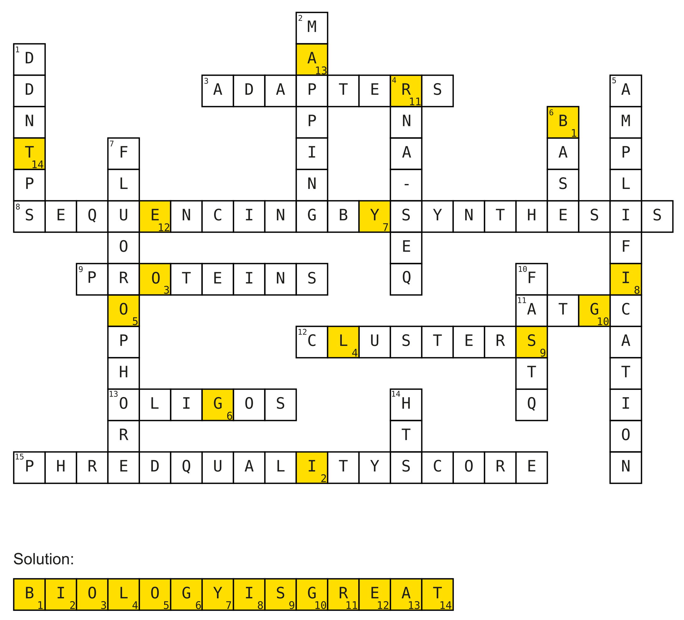

```{r, include=FALSE}
source("custom_functions.R")
library(flextable)
library(officer)

```

---
title: "Exercise sheet 9: Data Driven Life Sciences"
---

---------------------------------

# Exercise 1

#### {.tabset}

##### Question 1A
::: {.question data-latex=""}
Arrange the following terms into their correct order in the Illumina sequencing method and describe each of them briefly:

- bridge amplification

- deblocking

- library preparation

- annealing of template strands to flow cell

- fluorescence detection
::: 

##### Solution
::: {.answer data-latex=""}
**1. Library preparation:**

A sequencing *library* gets *prepared* from a sample by fragmenting the original DNA and adding Illumina-specific adapter sequences to both ends of the fragments. The *library* is what gets read during sequencing.

**2. Template strand annealing**

The single-stranded library fragments are used as *template strands* in the sequencing and are *annealed* to primer sequences, which are bound to the *flow cell* and are complementary to the adapter sequences of the fragments.

**3. Bridge amplification**

After complementary strands have been synthesized and the templates been washed off, the now flow cell-bound fragments are *amplified* in several cycles of so-called *bridge-amplification* to form fragment colonies, or *clusters* on the flow cell to guarantee a detectable fluorescence signal during sequencing. 

**4. Fluorescence detection**

Illumina-sequencing is a form of *sequencing-by-synthesis* in which the nucleotides incorporated into the growing strand are detected via attached *fluorophores*. After the first $3$ steps, the following steps are iterated to sequence the entire read:

Modified nucleotides, containing a fluorescent group, are used to extend the strand, their blocking groups are cleaved from their 3`-OH groups.

**5. Deblocking**

*Deblocking* is the removal of the fluorophore (blocking group). It is necessary before a new round of elongation by one nucleotide can begin.


More information about this topic can be found on the [Illumina Webpage](https://www.illumina.com/science/technology/next-generation-sequencing/sequencing-technology.html).
::: 
#### {-}

# Exercise 2

#### {.tabset}
```{r, echo=FALSE, out.width="75%", fig.align='center'}

```

##### Question 2A
::: {.question data-latex=""}

**Solve the crossword puzzle!**

Horizontal:

- 3. Added to DNA fragments during library preparation.

- 6. Has a sequencing method named after himself (first name)

- 7. Illumina/Pacbio way of determining the order of nucleotides in a DNA strand. (3 words)

- 8. More than just single-end. (2 words)

- 11. The alphabet of life.

- 12. Formed by bridge-amplification on Illumina flow-cells.

- 13. Keeps nucleic acid synthesis going.

- 14. Measure to asses the quality of the identification of nucleobases generated by automated DNA sequencing. (3 words)


Vertical:

- 1. Dideoxynucleosidetriphosphates (abbrev.)

- 2. Process of determining positions of reads on the reference genome.

- 4. The process of making many copies of a piece of DNA.

- 5. Found in pairs in DNA.

- 6. Chemical group attached to nucleotides to monitor incorporation into DNA.

- 9. Breakthrough sequencing method (abbrev.)

- 10. File format used to store sequence information.
::: 
##### Solution
::: {.answer data-latex=""}
```{r, echo=FALSE, out.width="75%", fig.align='center'}

```
::: 
#### {-}

# Exercise 3

#### {.tabset}

##### Question 3A
::: {.question data-latex=""}
You want to determine how many reads $N$ are needed to achieve a coverage depth $C$ of 20X when sequencing reads for *Escherichia coli*.

The length of the reads $L$ is 30nt and the *E. coli* genome $G$ is approximately 4.6 million bases long.
::: 

##### Formula
::: {.answer data-latex=""}
$$
N = \frac{C\times G}{L}
$$
::: 

##### Formula
::: {.answer data-latex=""}
$$
N = \frac{20\times 4600000}{30} \approx 3066667 \text{ reads}
$$
::: 


