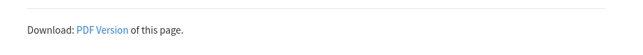
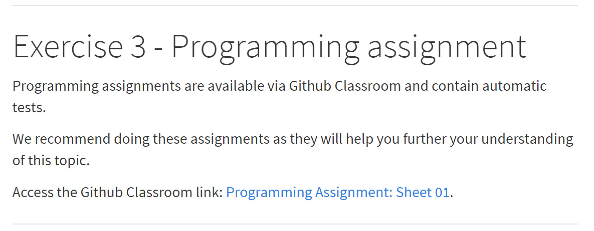
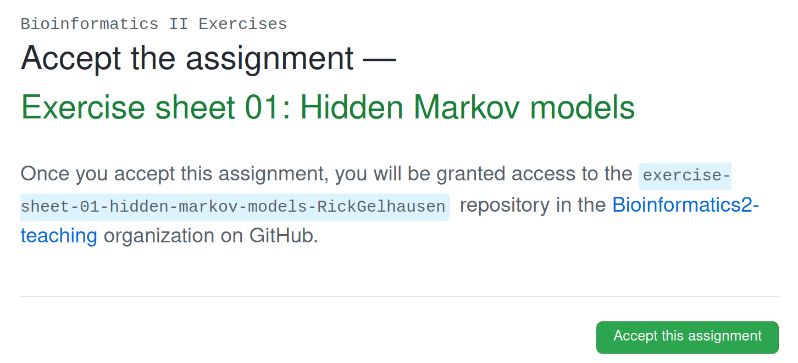

# Exercise Material

All exercise material can be accessed via this webpage.

Exercises are provided as a practical addition to the lectures and will help you to better understand the topics of the lecture.

Results will be discussed in the weekly exercise sessions.

## Setup

You can access individual exercise sheets using the navigation bar.

---------------------------------
```{r, echo=FALSE, out.width="100%", fig.align='left'}

```
---------------------------------

All exercise sheets are made for self-learning and provide questions, hints and a master-solution.

There are no deadlines when exercises should be finished.
Keep in mind though that exercise discussions will be held every week for a certain exercise sheet. We advise you to do one exercise-sheet every week to not lose track of the discussions.

A detailed schedule is available on our Ilias page.

## Pdf-version

A pdf-version of each exercise sheet is available for download on the bottom of each exercise sheet.

---------------------------------
```{r, echo=FALSE, out.width="80%", fig.align='left'}

```
---------------------------------

# Programming Tasks

Some exercise-sheets have programming tasks.

Whenever a programming task is available you will be redirected to our Github Classroom page:

---------------------------------
```{r, echo=FALSE, out.width="80%", fig.align='left'}

```
---------------------------------

In Github Classroom we provide automated testing for solutions written in python. You are of course welcome to use whatever language you prefer, but the automatic tests will not work for other languages.

The link provided will lead you to the specific assignment.

---------------------------------
```{r, echo=FALSE, out.width="80%", fig.align='left'}

```
---------------------------------

Once you accept the prompt shown on Github, a custom Github repository will be created for yourself, with your Github Name as a suffix.

---------------------------------
```{r, echo=FALSE, out.width="80%", fig.align='left'}
knitr::include_graphics("figures/howto/ready.png")
```
---------------------------------

If you follow this link you will be able to see your personal Github repository. This will contain all the necessary files and descriptions to complete the programming task.
The task description will be given in the README.md which is also visible below the source code.

The important file for you will be the `exercise-sheet.py` file. It contains skeletons for all the functions you need to write with additional explanations.

You can either edit this file directly via Github using the edit button, or clone the repository to your PC and edit it with your preferred IDE.

```{r, include=knitr::is_html_output(), echo=F}
knitr::asis_output('If you are not familiar with Github or similar systems, we recommend that you spend some time to get used to it: <a href="https://docs.github.com/en/get-started" title=" ">Github Docs</a>')
```

For this course, you will mainly need the basic `git clone`, `git add`, `git commit`, `git push` and `git pull` commands.

Once you have solved the programming task, you can push your changes to the repository, which will trigger the automatic testing of your code.
